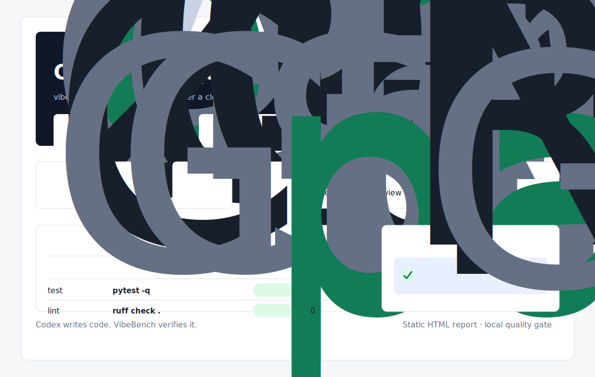
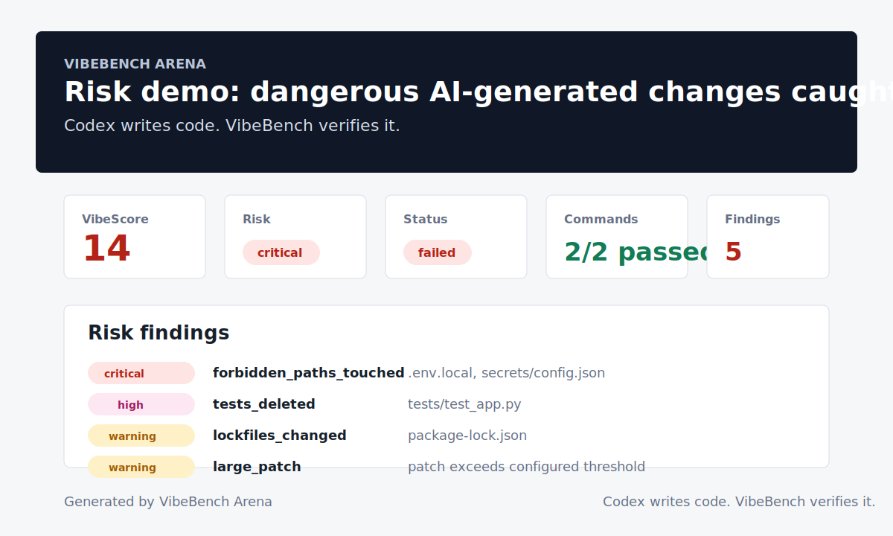

# VibeBench Arena

**Codex-first quality gate for vibe coding projects.**

> Codex writes code. VibeBench verifies it.

[](https://github.com/wemby-1/vibebench-arena/actions/workflows/ci.yml)




<!-- VIBEBENCH_STATUS_START -->
## VibeBench Status

- Overall status: passed
- VibeScore: 100
- Risk level: low
- Changed files: 0
- Patch lines: 0
- Risk findings: 0

<!-- VIBEBENCH_STATUS_END -->

VibeBench Arena is a local verification tool for Codex-first and AI-assisted
coding workflows. It helps developers check whether AI-generated code is safe to
review, commit, and ship.

The project is intentionally small today. v0.1.0 focuses on a clean CLI, local
checks, Git diff risk analysis, VibeScore, and a static HTML report.

## Why VibeBench?

AI coding agents can produce useful changes quickly, but speed creates review
pressure. VibeBench adds a local quality gate between generated code and shipping
decisions.

It is designed to be:

- local-first and easy to run inside an existing repository
- readable for developers who are new to Python tooling
- useful in Codex-first workflows without replacing human review
- incremental, with focused milestones instead of a large benchmark platform

## What It Checks Today

Current VibeBench supports:

- config initialization with `.vibebench/config.yaml`
- configured test and lint commands
- VibeScore and risk level calculation
- Git diff risk analysis for uncommitted changes
- static HTML reports for local review and screenshots
- PR-ready Markdown summaries for pasteable code review comments
- Shields.io-compatible badge artifacts for README, CI, and status integrations
- machine-readable JSON/Markdown exports for dashboards and external tools
- GitHub Actions annotations and step summaries without GitHub API posting

Git diff risk analysis flags:

- deleted test files
- touched `.env`, `.env.*`, or `secrets/` paths
- secret-like paths containing words such as `token`, `api_key`, or `password`
- changed lockfiles such as `package-lock.json`, `poetry.lock`, or `uv.lock`
- large patches over the configured threshold
- changes touching more files than the configured threshold

These Git diff rules are configurable in `.vibebench/config.yaml` under the `risk` section.

## Quick Start

```bash
python -m pip install -e ".[dev]"
python -m vibebench init
python -m vibebench config
python -m vibebench doctor
python -m vibebench history
python -m vibebench latest
python -m vibebench latest --all-paths
python -m vibebench latest --artifact report --path-only
python -m vibebench trend
python -m vibebench baseline --set latest
python -m vibebench clean
python -m vibebench check
python -m vibebench gate
python -m vibebench ci
python -m vibebench report
python -m vibebench pr-comment
python -m vibebench explain
python -m vibebench bundle
python -m vibebench export
python -m vibebench badge
python -m vibebench badge --format markdown
python -m vibebench badge --format url
python -m vibebench status-block
python -m vibebench manifest
python -m vibebench artifacts
python -m vibebench annotate
python -m vibebench gh-summary
python -m vibebench compare
```

`vibebench init` creates `.vibebench/config.yaml` and `.github/workflows/vibebench.yml`. Existing files are skipped unless `--force` is used; `--no-workflow` and `--workflow-only` support partial bootstrap.

`vibebench config` prints the effective project, checks, gate, and risk configuration. Use `--json` for machine-readable output, `--validate` for a short validation result, `--check` for consistency diagnostics, `--check --advice` for repair guidance, and `--show-source` to see whether major sections came from the config file or built-in defaults.

The default config looks like this:

```yaml
project:
  name: vibebench-project

checks:
  test:
    - pytest -q
  lint:
    - ruff check .

risk_rules:
  forbidden_paths:
    - .env
    - .env.*
    - secrets/
  warn_if_tests_deleted: true
  warn_if_lockfiles_changed: true
  large_patch_lines: 500

risk:
  max_changed_files: 20
  max_patch_lines: 500
  forbidden_paths:
    - .env
    - .env.*
    - secrets/
  secret_like_paths:
    - "*secret*"
    - "*token*"
    - "*credential*"
    - "*credentials*"
    - "*private_key*"
    - "*api_key*"
    - "*apikey*"
    - "*password*"
    - "*passwd*"
  lockfiles:
    - package-lock.json
    - pnpm-lock.yaml
    - yarn.lock
    - poetry.lock
    - uv.lock
    - Pipfile.lock
    - requirements.lock
  test_path_patterns:
    - tests/
    - test_*.py
    - "*_test.py"
    - __tests__/
    - "*.test.ts"
    - "*.test.tsx"
    - "*.spec.ts"
    - "*.spec.tsx"

gate:
  min_score: 80
  max_risk: medium
  allow_findings: 0
  require_status_passed: true
```

## Example Workflow

```bash
# Create project config once
python -m vibebench init

# Inspect and validate the effective configuration
python -m vibebench config --show-source

# Diagnose whether the project is ready for VibeBench
python -m vibebench doctor

# Show recent VibeBench runs and quality trend
python -m vibebench history
python -m vibebench trend
python -m vibebench trend --json
python -m vibebench trend --limit 3
python -m vibebench trend --write-summary

# Mark the latest run as the project baseline
python -m vibebench baseline --set latest

# Preview cleanup of old local runs
python -m vibebench clean

# Run local quality gate before committing
python -m vibebench check

# Enforce explicit pass/fail thresholds
python -m vibebench gate

# Run the complete local/CI pipeline
python -m vibebench ci

# Generate a static local report
python -m vibebench report

# Generate a Markdown summary for a PR or review thread
python -m vibebench pr-comment

# Explain the latest run in human-readable Markdown
python -m vibebench explain

# Package one run's artifacts into a zip file
python -m vibebench bundle

# Export JSON for dashboards or Markdown for lightweight sharing
python -m vibebench export
python -m vibebench export --format markdown

# Generate Shields.io-compatible badge artifacts
python -m vibebench badge
python -m vibebench badge --format markdown
python -m vibebench badge --format url
python -m vibebench badge --format markdown --label "VibeScore"

# Generate or update a README status block
python -m vibebench status-block
python -m vibebench status-block --title "Project Quality"
python -m vibebench status-block --no-include-artifacts
python -m vibebench status-block --output README-status.md
python -m vibebench status-block --readme README.md --write-readme
python -m vibebench status-block --readme README.md --check-readme

# List known artifacts for a run
python -m vibebench artifacts
python -m vibebench artifacts --json
python -m vibebench artifacts --run-dir .vibebench/runs/<run-id>
python -m vibebench artifacts --only-available

# Emit GitHub Actions annotations for findings and command failures
python -m vibebench annotate

# Write a GitHub Actions step summary or local summary file
python -m vibebench gh-summary

# Compare the latest run with the previous run
python -m vibebench compare
```

`vibebench config --show` validates and summarizes the active `.vibebench/config.yaml`, including project name, configured commands, gate policy, and risk policy. Use `python -m vibebench config --show --json` for machine-readable config inspection. Use `python -m vibebench config --check`, `python -m vibebench config --check --advice`, or `python -m vibebench config --check --json --advice` to run focused consistency diagnostics before the full pipeline. Add `--write-json PATH` or `--write-summary PATH` to persist `config-check.json` or `config-check.md` artifacts.

`vibebench doctor` is a lightweight environment check for Python, Git, config validity, configured command executables, and whether `.vibebench/runs/` is writable. It does not run the configured checks. Use `python -m vibebench doctor --strict` for a stronger release/CI preflight that also expects recent run artifacts such as the manifest, bundle, and report. Add `--advice` to show concise repair suggestions without modifying files, for example `python -m vibebench doctor --strict --advice`. Use `python -m vibebench doctor --json`, `python -m vibebench doctor --json --strict`, or `python -m vibebench doctor --json --strict --advice` for machine-readable diagnostics.

`vibebench history` shows recent runs from `.vibebench/runs/`, including score, risk level, diff size, finding count, and generated artifact status.

`vibebench latest` locates the newest valid run and its known artifacts. Use `--json` for automation, `--all-paths` to print every available artifact path for scripts or local debugging, `--artifact NAME` to inspect one artifact, and `--path-only` with `--artifact` for scripts that only need one available artifact path.

`vibebench trend` summarizes recent runs newest first and reports whether quality is `improved`, `stable`, or `regressed` across the selected window. The verdict compares latest vs oldest score, risk level, and finding count. Use `--json`, `--limit N`, or `--runs-dir PATH` for automation and archived run directories. Use `--write-summary` to persist human-readable `.vibebench/runs/<timestamp>/trend.md`, `--write-json` to persist machine-readable `trend.json`, `--output PATH` for a custom Markdown destination, or `--json-output PATH` for a custom JSON destination.

`vibebench baseline --set latest` saves a baseline run in `.vibebench/baseline.json`. `vibebench compare --baseline` compares that saved baseline against the latest run.

`vibebench clean` safely previews cleanup of old local runs. It is dry-run by default and only deletes with `--yes`.

`vibebench gate` turns an existing run into an explicit pass/fail decision for local use or CI. Gate thresholds can live in `.vibebench/config.yaml`; CLI flags such as `--min-score` and `--max-risk` override config values for one run. Use `--baseline` to also fail on regressions against the saved baseline.

`vibebench check` writes:

```text
.vibebench/runs/<timestamp>/metrics.json
.vibebench/runs/<timestamp>/check.log
```

`vibebench report` writes:

```text
.vibebench/runs/<timestamp>/report/index.html
```

`vibebench pr-comment` writes:

```text
.vibebench/runs/<timestamp>/pr-comment.md
```

`vibebench explain` writes:

```text
.vibebench/runs/<timestamp>/explain.md
```

It explains command failures, Git diff risk signals, risk findings, and suggested next actions. Use `--run-dir`, `--output`, or `--no-write` for targeted local review.

`vibebench manifest` writes `.vibebench/runs/<timestamp>/manifest.json`, a machine-readable index of the run status, score, risk, diff size, finding count, and known artifact availability for automation and CI consumers. Use `vibebench manifest --check` to verify that an existing manifest still matches the run directory. `vibebench ci` generates and checks it by default unless `--skip-manifest` is used.

`vibebench bundle` writes:

```text
.vibebench/runs/<timestamp>/vibebench-bundle.zip
```

It packages standard run artifacts for sharing or CI download. Use `--run-dir` for a specific run, `--output` for a custom zip path, `--include-report-assets` to include the full report directory, and `--strict` to fail when any standard artifact is missing.

`vibebench export` prints a stable machine-readable JSON summary by default. Use `--pretty` for indented JSON, `--format markdown` for lightweight sharing, and `--output` to write the export to a file. `vibebench ci` writes `.vibebench/runs/<timestamp>/export.json` by default.

`vibebench badge` writes a Shields.io-compatible endpoint JSON artifact at `.vibebench/runs/<timestamp>/badge.json` by default. Use `--format markdown` to write a copy-pasteable README image badge to `badge.md`, or `--format url` to write the static Shields URL to `badge-url.txt`. `--label` customizes all formats, and `--output` writes the selected format to a custom path. `vibebench ci` writes both `badge.json` and `badge.md` by default.

`vibebench status-block` writes `.vibebench/runs/<timestamp>/status-block.md`, a copy-pasteable README section with status, score, risk, diff size, findings, badge, and generated artifacts. Use `--title`, `--no-include-badge`, `--no-include-artifacts`, or `--output` to customize it. Add `<!-- VIBEBENCH_STATUS_START -->` and `<!-- VIBEBENCH_STATUS_END -->` markers to a README, then run `python -m vibebench status-block --readme README.md --write-readme` to update only the marked region. Use `--check-readme` in read-only workflows to fail when the committed block is stale.

`vibebench artifacts` lists known files for the latest run, including metrics, logs, reports, config check artifacts, summaries, trend summaries, badges, status blocks, bundles, and comparisons. Use `--json` for automation, `--run-dir .vibebench/runs/<run-id>` for a specific run, `--only-available` to hide missing optional files, and `--strict` when every known artifact must exist.

`vibebench annotate` emits GitHub Actions annotations for command failures and risk findings from the latest run. Use `--no-github-actions` for readable plain text output. It is reporting-only and exits 0 when annotations are emitted; `vibebench gate` remains responsible for pass/fail decisions.

`vibebench compare` writes:

```text
.vibebench/runs/<latest-timestamp>/compare.md
```

It compares the latest run with the previous run, including score, risk level, command counts, diff size, and risk finding count.

## One-Shot CI Pipeline

`vibebench ci` is the recommended CI entrypoint. It runs check, gate, config check artifact generation, report, PR comment, explanation, export, badge, status block, trend summaries, GitHub annotations, bundle, and GitHub summary in order. The check and gate steps decide the final pass/fail verdict, while artifact steps are still attempted even when the quality gate fails.

Useful options include `--skip-report`, `--skip-pr-comment`, `--skip-explain`, `--skip-export`, `--skip-badge`, `--skip-status-block`, `--skip-trend`, `--skip-config-check`, `--skip-bundle`, `--skip-annotate`, `--skip-gh-summary`, `--bundle-include-report-assets`, and `--bundle-strict`. Gate overrides such as `--min-score`, `--max-risk`, `--allow-findings`, and `--no-require-status-passed` are passed through to the gate step. Use `--run-dir .vibebench/runs/<run-id>` to generate artifacts and enforce the gate against an existing run without creating a fresh check run.

## What The HTML Report Shows

The static report is a dependency-light HTML file suitable for local review,
screenshots, and README demos. It includes:

- project name and run timestamp
- overall status, VibeScore, and risk level
- command results for test and lint checks
- risk findings from Git diff analysis
- changed files and patch line summary
- a short recommendation for review or shipping

Generated reports under `.vibebench/runs/` are local artifacts and should not be
committed. The image at `docs/assets/report-preview.svg` is a static README
preview asset.

## PR Comment Summary

`vibebench pr-comment` generates a concise Markdown summary that can be pasted
into a GitHub Pull Request, issue, or code review. It includes:

- overall status, VibeScore, risk level, project name, and timestamp
- command results for configured checks
- Git diff risk summary counts
- up to 10 risk findings with affected paths
- the same recommendation used by the HTML report

Automatic GitHub PR posting is planned later; the current command is local and
does not call the GitHub API.

## Run Explanation

`vibebench explain` generates a human-readable Markdown explanation for the latest run. It is meant for local review and CI artifacts: what passed, what failed, what Git diff risks were found, and what to do next.

## GitHub Actions

`vibebench annotate` emits GitHub Actions annotations for visible risk findings and command failures. `vibebench gh-summary` writes a concise Markdown summary to the GitHub Actions step summary when `GITHUB_STEP_SUMMARY` is set. It does not post PR comments through the GitHub API yet.

This repository dogfoods VibeBench in its own CI: after direct Ruff and pytest checks, CI runs `vibebench ci`, which enforces the policy in `.vibebench/config.yaml` and generates config-check/report/comment/explanation/export/badge/status-block/trend output, including `config-check.json`, `config-check.md`, `trend.md`, and `trend.json`, emits annotations, bundles run artifacts, writes summaries, and uploads `.vibebench/runs`. `vibebench init` can generate a starter workflow at `.github/workflows/vibebench.yml`; see [docs/examples/github-actions/vibebench.yml](docs/examples/github-actions/vibebench.yml) and [docs/github-actions.md](docs/github-actions.md) for details.

## Try The Risk Demo

A clean 100/100 run is useful, but VibeBench is meant to catch risky generated changes before they ship. The risk demo creates a temporary repository with a clean baseline commit, then intentionally leaves suspicious uncommitted changes for VibeBench to analyze.

```bash
python examples/risk-demo/create_risky_repo.py
cd /tmp/vibebench-risk-demo
python -m vibebench check
python -m vibebench gate
python -m vibebench ci
python -m vibebench report
python -m vibebench pr-comment
python -m vibebench explain
python -m vibebench bundle
```

The demo intentionally touches `.env.local` and `secrets/`, deletes a test file, changes a lockfile, and creates a large patch. `vibebench check` is expected to fail because critical findings are present.



See [examples/risk-demo/README.md](examples/risk-demo/README.md) for details.

## Documentation

- [Quickstart](docs/quickstart.md)
- [Risk rules](docs/risk-rules.md)
- [GitHub Actions](docs/github-actions.md)
- [Contributing](CONTRIBUTING.md)
- [Security](SECURITY.md)
- [Changelog](CHANGELOG.md)

## Roadmap

Planned next milestones:

- automatic GitHub PR comment posting
- richer GitHub Action integration
- multi-agent arena workflows
- replay timeline for AI-generated changes

Not in v0.1.0:

- hosted benchmark leaderboards
- browser app or dashboard server
- multi-agent tournament system

## Built With A Codex-First Workflow

VibeBench Arena is built around a simple principle:

> Codex writes code. VibeBench verifies it.

That means small milestones, clear tests, readable implementation, and local
checks that fit naturally into AI-assisted development. VibeBench does not
replace human review; it gives reviewers a better starting point.
