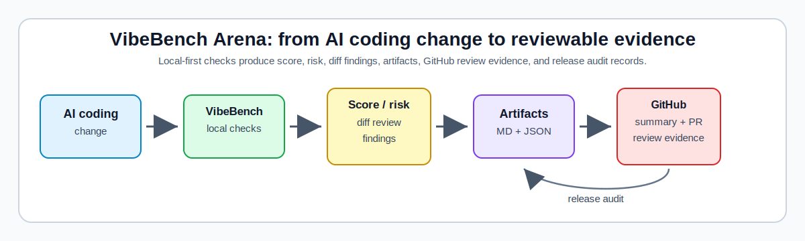

# VibeBench Arena

**The Codex-first / vibe-coding quality console for turning AI-assisted changes into reviewable evidence.**

> Codex writes code. VibeBench verifies it.

[](https://github.com/wemby-1/vibebench-arena/actions/workflows/ci.yml)


<!-- VIBEBENCH_STATUS_START -->
## VibeBench Status

- Overall status: passed
- VibeScore: 100
- Risk level: low
- Changed files: 0
- Patch lines: 0
- Risk findings: 0

<!-- VIBEBENCH_STATUS_END -->

AI coding is getting easier; reviewing, auditing, comparing, and trusting AI-generated changes is still the hard part. VibeBench Arena is a local-first quality console for Codex-first / vibe-coding engineering: it turns AI-assisted changes into checks, risk review, artifact-backed summaries, and release readiness evidence.

It is not a generic chatbot, RAG demo, benchmark-only project, prompt collection, or leaderboard. VibeBench sits after the agent writes code and before humans merge or release it, so "seems to work" becomes something inspectable, auditable, and reproducible.



## How It Works

1. Run a local showcase or CI plan with `python3 -m vibebench demo` or `python3 -m vibebench ci --dry-run`.
2. Inspect score, risk, diff movement, and findings.
3. Review generated artifacts for GitHub-ready evidence.
4. Use release audit outputs for release readiness review.

See the [architecture](docs/architecture.md), [artifact gallery](docs/artifact-gallery.md), [product strategy](docs/product-strategy.md), [commercial potential](docs/commercial-potential.md), and [public roadmap](docs/roadmap-public.md).

## Evaluate Quickly

- [Review in 3 minutes](docs/review-hub.html): a public review hub and [reviewer guide](docs/reviewer-guide.md) for external evaluators inspecting proof, site preview, and evidence-room artifacts.
- [Trust Center](docs/trust-center.html): project-maintained local-first, privacy, reproducibility, and artifact-safety boundaries; not a third-party certification.
- [Security Questionnaire](docs/security-questionnaire.html): project-maintained adopter-facing Q&A about local-first behavior, artifact sharing, CI uploads, static HTML safety, JSON purity, and non-claims; not a third-party certification or audit.
- [Evaluate in 5 minutes](docs/evaluate.md): a compact path for developers, teams, maintainers, and observers to verify the local-first, evidence-first workflow.
- [Pages entry](docs/index.html): the GitHub Pages-ready public start page; see [Pages setup](docs/pages.md) for manual setup.
- [Product showcase](docs/showcase.html): a GitHub Pages-ready Codex-first quality console overview of the CLI, CI proof packet, artifacts, and self-contained `proof.html`.
- [Adoption guide](docs/adoption.md): a safe first-week path for Codex-first / vibe-coding teams.
- [Demo guide](docs/demo.md): commands that prove the core local workflow without external service dependency.
- Create a one-command evidence room: `python3 -m vibebench evidence-room --output-dir PATH --zip`, then open `index.html`, `security-questionnaire.html`, and `review-scorecard.html`; inspect `share-check.md` for the local pre-sharing scan summary when needed. Evidence rooms include `share-check.json` and `share-check.md`. Or run `python3 -m vibebench ci` and locate it with `python3 -m vibebench latest --artifact evidence-room-index-html --path-only`.
- Check metrics contract readiness with `python3 -m vibebench metrics-check` for one run, then use `python3 -m vibebench metrics-diff` to explain numeric metric changes between a baseline and candidate. `metrics-check` validates `metrics.json`; report-only `metrics-diff` explains what changed; `metrics-diff --enforce-policy` or `ci --metrics-diff-policy` enforces acceptable drift thresholds from `metrics_diff.policy`; `regression-check` remains the high-level score/risk gate. Default CI is unchanged unless you opt in. Use `python3 -m vibebench ci --metrics-check --metrics-diff --json` for report artifacts, or `python3 -m vibebench ci --metrics-diff-policy --json` when the diff policy should fail CI; retrieve diff artifacts with `latest --artifact metrics-diff-json --path-only` or `latest --artifact metrics-diff-md --path-only`.
- Compare candidate run quality with `python3 -m vibebench regression-check`; for stable gates, run `python3 -m vibebench ci --json`, dry-run `python3 -m vibebench baseline --promote-latest --label stable --dry-run --json`, then promote with `python3 -m vibebench baseline --promote-latest --label stable` only if checks pass. Configure `regression.enabled: true` with `baseline_label: stable` for future `ci --json` runs. `--set-latest` remains direct/manual; `--promote-latest` is the guarded path. CI does not auto-promote baselines. Export with `python3 -m vibebench baseline --export --label stable --output baseline.json`, verify with `python3 -m vibebench baseline --verify --input baseline.json --require-portable`, and import with `python3 -m vibebench baseline --import baseline.json --label stable` when another machine needs the same portable snapshot.
- Before sharing an evidence room, proof packet, static preview, or zip externally, run `python3 -m vibebench share-check PATH`; use `python3 -m vibebench share-check PATH --json` for machine-readable output. It is a local pre-sharing aid, not a security certification, third-party audit, or guarantee, so manually review artifacts before publishing.
- Generate a shareable proof packet: `python3 -m vibebench proof --output-dir .vibebench/proof-packet --zip` writes Markdown, JSON, a self-contained evidence-first HTML report, a manifest, and `proof.zip`; GitHub Actions shows a proof packet summary card and uploads the downloadable `vibebench-proof-packet` artifact.
- Build a static preview bundle before publishing edits: `python3 -m vibebench site-preview --output-dir /tmp/vibebench-site-preview --zip`, then verify it with `python3 -m vibebench site-preview --verify /tmp/vibebench-site-preview/site-preview.zip`; CI reuses the same command for `vibebench-site-preview` without enabling GitHub Pages automatically.
- [Comparison](docs/comparison.md): where VibeBench fits beside CI, tests, benchmarks, chatbots, and review assistants.
- [FAQ](docs/faq.md): direct answers about scope, limits, artifacts, and local-first review.
- [Case study](docs/case-study.md): how an AI-assisted change becomes reviewable evidence.
- [Artifact gallery](docs/artifact-gallery.md): the concrete outputs reviewers inspect.
- [Architecture](docs/architecture.md): the local-first evidence flow.

Use this path if you are evaluating VibeBench as a Codex-first / vibe-coding quality console: run the demo, inspect JSON and artifacts, read the case study, then decide whether the audit-friendly evidence is strong enough for a small repo pilot. The project is built for developers and teams evaluating AI-assisted coding workflows, without fake traction or investment claims.

## See The Case Study

Read [Case Study: From Vibe-Coded Change to Reviewable Evidence](docs/case-study.md) to see how an AI-assisted change can become a review packet with checks, risk scoring, artifacts, comparison, and release readiness evidence. The checked-in [case-study artifact folder](examples/showcase-artifacts/case-study/README.md) shows the small static example behind the walkthrough.

```bash
python3 -m vibebench demo
```

That one-command demo prints the public showcase path and points to the checked-in sample artifact pack. Use `python3 -m vibebench demo --copy-to /tmp/vibebench-demo` to copy the evidence pack for local inspection.

## What You Get

- CI-style checks and a dry-run quality pipeline for local or GitHub Actions workflows.
- Risk and diff review that highlights suspicious paths, deleted tests, lockfile movement, and broad patches.
- Artifact-backed summaries: Markdown, JSON, report previews, manifests, comparisons, badges, bundles, and GitHub-friendly review text.
- Release and publish readiness checks that create local audit records without hidden publishing, tagging, or GitHub Release side effects.
- A local-first workflow designed for Codex-first / vibe-coding teams that still want human review and reproducible evidence.

## Why This Is Different

VibeBench is the evidence layer around AI-assisted coding. It does not try to replace the coding agent or the reviewer; it records what happened, what ran, what changed, and which artifacts a human can inspect next.

That makes it useful for new GitHub visitors as well as maintainers: the repository can show its quality console, one-command demo, artifact gallery, and release-readiness flow without asking for a hosted account or external service.

## Product Thesis

VibeBench is not a toy CLI; it is an early local-first product direction for AI coding quality control. The current CLI, demo, artifact gallery, release readiness checks, and public docs are the foundation for a broader Codex-first / vibe-coding quality console.

Read the [product strategy](docs/product-strategy.md), [public roadmap](docs/roadmap-public.md), and [commercial potential](docs/commercial-potential.md) for the problem, product thesis, possible growth paths, and honest limitations. The project is ambitious, but it does not claim fake traction, fake revenue, fake investors, or promised outcomes.

## Start Here

1. Run the one-command demo: `python3 -m vibebench demo`.
2. Follow the [3-minute review hub](docs/review-hub.html) or [5-minute evaluation guide](docs/evaluate.md), then open the [adoption guide](docs/adoption.md), [demo guide](docs/demo.md), and [artifact gallery](docs/artifact-gallery.md).
3. Inspect the checked-in [sample artifact pack](examples/showcase-artifacts/sample/README.md) or copy it with `python3 -m vibebench demo --copy-to /tmp/vibebench-demo`.
4. Read the [case study](docs/case-study.md), [comparison](docs/comparison.md), [FAQ](docs/faq.md), [architecture](docs/architecture.md), [positioning](docs/positioning.md), [use cases](docs/use-cases.md), [product strategy](docs/product-strategy.md), [public roadmap](docs/roadmap-public.md), and [commercial potential](docs/commercial-potential.md) to see why this matters for Codex-first / vibe-coding engineering.
5. Use the GitHub issue templates to share a use case, report demo feedback, or propose a focused PR.

For bounded, low-cost Codex milestones, use the [Codex task template](docs/codex-task-template.md).

## Why This Exists

AI coding agents can produce useful changes quickly, but speed creates review pressure. VibeBench adds a local quality gate between generated code and shipping decisions:

- reproducible local and CI checks
- readable Markdown and JSON artifacts
- latest-run, compare, package, release-check, and release-audit records
- no replacement for human review, and no hidden publish/release side effects

## Help Shape VibeBench

If you care about better AI coding review, audit tooling, and artifacts, starring the repo helps signal that this local-first workflow matters. Open a use case issue if you are using Codex, Cursor, Claude Code, GitHub Copilot, or another AI coding tool; open demo feedback if the artifact gallery or sample outputs are unclear; and send small, scoped PRs with clear verification commands.

## What You Can See In 5 Minutes

- Run `python3 -m vibebench demo` to inspect the local showcase demo and checked-in artifact pack.
- Run `python3 -m vibebench demo --json` or `python3 -m vibebench demo --copy-to /tmp/vibebench-demo` to script or copy the sample evidence pack.
- Run `python3 -m vibebench ci --dry-run` to see the planned quality pipeline.
- Run `python3 -m vibebench regression-check` before sharing or releasing when at least two runs exist; automatic previous-run inference is convenient for experiments, while guarded pinned baselines plus config are better for stable gates. Generate a candidate with `python3 -m vibebench ci --json`, dry-run `python3 -m vibebench baseline --promote-latest --label stable --dry-run --json`, promote with `python3 -m vibebench baseline --promote-latest --label stable`, verify with `python3 -m vibebench baseline --show --label stable --json`, then run future checks with `python3 -m vibebench ci --regression-check --baseline-label stable --json` or config-enabled `ci --json`. This compares candidate score and risk against the baseline run and is not a benchmark certification.
- Run `python3 -m vibebench evidence-room --output-dir PATH --zip` to create a local evidence room combining the proof packet and static site preview, then verify it with `python3 -m vibebench evidence-room --verify PATH`. Open `index.html` first, then inspect `share-check.md` for the pre-sharing scan summary if you want the local share-check result. Evidence rooms include `share-check.json` and `share-check.md`. GitHub Actions uploads the same evidence-first package as `vibebench-evidence-room`.
- Run `python3 -m vibebench share-check PATH` before sharing generated evidence rooms, proof packets, static previews, or zip files; add `--json` for automation. The scanner is local-only and does not replace manual artifact review.
- Open the evidence-room `trust-center.html` or [docs Trust Center](docs/trust-center.html) for local-first, privacy, reproducibility, and artifact-safety boundaries.
- Open the evidence-room `security-questionnaire.html` or [docs Security Questionnaire](docs/security-questionnaire.html) for adopter-facing Q&A about local-first behavior, artifact sharing, CI uploads, static HTML safety, JSON purity, and non-claims. It is project-maintained documentation, not a third-party certification or audit.
- Run `python3 -m vibebench proof --output-dir /tmp/vibebench-proof --zip` to generate a shareable proof packet with self-contained, evidence-first `proof.html`, then run `python3 -m vibebench proof --verify /tmp/vibebench-proof/proof.zip` to verify it. GitHub Actions also shows a proof packet summary card and uploads the same packet as `vibebench-proof-packet`.
- Run `python3 -m vibebench ci` to generate local run artifacts, including `evidence-room/`; use `python3 -m vibebench ci --skip-evidence-room` when you only want the rest of the pipeline.
- Run `python3 -m vibebench latest --all-paths` to inspect the newest outputs.
- Run `python3 -m vibebench release-check` to inspect release readiness.
- Run `python3 -m vibebench release-audit --zip --output-dir /tmp/vibebench-release-audit-demo` to create a local audit bundle without publishing, tagging, or creating a GitHub Release.

## What VibeBench Produces

VibeBench does not stop at a single status line. It leaves evidence that can move through local review, GitHub Actions, release audit, and human decision-making. See the [artifact gallery](docs/artifact-gallery.md), [sample artifact pack](examples/showcase-artifacts/sample/README.md), [public demo](docs/demo.md), [quickstart demo](examples/quickstart-demo/README.md), and [showcase artifacts](examples/showcase-artifacts/README.md).

| Artifact / Output | Purpose | Command | Why it matters |
| --- | --- | --- | --- |
| CI plan and run outputs | Preview or run the quality pipeline. | `python3 -m vibebench ci --dry-run --json` / `python3 -m vibebench ci` | Makes checks reproducible locally and in CI. |
| Artifact inventory and compare | Locate outputs and compare run movement. | `python3 -m vibebench artifacts --json` / `python3 -m vibebench compare --json` | Turns AI-assisted changes into reviewable evidence. |
| Release readiness and audit bundle | Record package, publish, checklist, release-body, and audit evidence. | `python3 -m vibebench release-check` / `python3 -m vibebench release-audit --zip` | Supports release decisions without publishing, tagging, or creating a GitHub Release. |

## What It Checks Today

Current VibeBench supports:

- config initialization with `.vibebench/config.yaml`
- configured test and lint commands
- VibeScore and risk level calculation
- Git diff risk analysis for uncommitted changes
- static HTML reports for local review and screenshots
- PR-ready Markdown summaries for pasteable code review comments
- Shields.io-compatible badge artifacts for README, CI, and status integrations
- machine-readable JSON/Markdown exports for dashboards and external tools
- GitHub Actions annotations and step summaries without GitHub API posting

Git diff risk analysis flags:

- deleted test files
- touched `.env`, `.env.*`, or sensitive local paths
- credential-like paths containing terms such as `credential`, `private_key`, or `apikey`
- changed lockfiles such as `package-lock.json`, `poetry.lock`, or `uv.lock`
- large patches over the configured threshold
- changes touching more files than the configured threshold

These Git diff rules are configurable in `.vibebench/config.yaml` under the `risk` section.

## Quick Start

```bash
python -m pip install -e ".[dev]"
python3 -m vibebench preflight
python3 -m vibebench preflight --json
python3 -m vibebench preflight --enforce-policy
python3 -m vibebench project-scan
python3 -m vibebench onboard
python3 -m vibebench onboard --json
python3 -m vibebench onboard --enforce-policy
python3 -m vibebench init --profile auto
python3 -m vibebench config --check
python3 -m vibebench workflow-template
python3 -m vibebench workflow-template --write
python3 -m vibebench workflow-check
python3 -m vibebench ci --dry-run
python3 -m vibebench ci --preflight
python3 -m vibebench ci --preflight-policy
python3 -m vibebench ci --adoption
python3 -m vibebench ci --adoption-policy
python3 -m vibebench ci --onboard
python3 -m vibebench ci --onboard-policy
python3 -m vibebench ci --project-scan
python3 -m vibebench ci --project-scan-policy
python3 -m vibebench ci
python -m vibebench config
python -m vibebench doctor
python -m vibebench release-check
python -m vibebench release-checklist
python -m vibebench release-checklist --write-json release-checklist.json
python -m vibebench release-checklist --write-summary release-checklist.md
python3 -m vibebench release-body --version v0.3.0 --check
python3 -m vibebench release-body --version v0.3.0 --output release-body.md
python -m vibebench release-audit
python3 -m vibebench release-audit --zip
python3 -m vibebench release-audit --zip-output release-audit.zip
python3 -m vibebench release-audit --verify release-audit.zip
python3 -m json.tool release-audit-manifest.json
python -m vibebench release-audit --output-dir .vibebench/release-audits/manual
python -m vibebench release-audit --version v0.3.0 --json
python -m vibebench package-check
python -m vibebench publish-check
python -m vibebench history
python -m vibebench latest
python -m vibebench latest --all-paths
python -m vibebench latest --artifact report --path-only
python -m vibebench trend
python -m vibebench baseline --set latest
python -m vibebench clean
python -m vibebench check
python -m vibebench gate
python -m vibebench ci
python -m vibebench report
python -m vibebench pr-comment
python -m vibebench explain
python -m vibebench bundle
python -m vibebench export
python -m vibebench badge
python -m vibebench badge --format markdown
python -m vibebench badge --format url
python -m vibebench status-block
python -m vibebench manifest
python -m vibebench run-index
python -m vibebench artifacts
python -m vibebench annotate
python -m vibebench gh-summary
python -m vibebench compare
```

`vibebench preflight` is the first safe read-only entry point and is report-only by default: it reuses project-scan, onboard, workflow-template preview, and workflow-check without creating config, runs, baselines, or workflows. `vibebench preflight --enforce-policy` evaluates `preflight.policy` as an explicit opt-in gate. `vibebench project-scan` is read-only inspection: it describes project readiness signals and is report-only by default. `vibebench project-scan --enforce-policy` evaluates `project_scan.policy`; `vibebench ci --project-scan` writes report-only `project-scan.json` and `project-scan.md`, while `vibebench ci --project-scan-policy` writes the same artifacts and fails CI when policy fails. `vibebench onboard` is a read-only human adoption plan; `vibebench onboard --enforce-policy` evaluates whether that plan is acceptable under `onboard.policy`. `vibebench ci --onboard` writes report-only `onboard.json` and `onboard.md`, while `vibebench ci --onboard-policy` writes the same artifacts and fails CI only when the onboarding policy fails. `python3 -m vibebench ci --preflight` writes report-only `preflight.json` and `preflight.md` adoption summaries for the run directory. `python3 -m vibebench ci --preflight-policy` writes the same artifact names and fails CI when `preflight.policy` fails; `--skip-preflight` suppresses both preflight modes. `python3 -m vibebench ci --adoption` creates a full report-only adoption evidence pack from project-scan, onboard, workflow-template, workflow-check, and preflight. `python3 -m vibebench ci --adoption-policy` uses the same artifact names but gates the policy-capable checks; workflow-template remains preview/report-only. The matching `--skip-*` flags suppress individual adoption checks, and default CI remains unchanged. `vibebench init --profile auto` creates a safe starter `.vibebench/config.yaml` without installing dependencies, creating runs/baselines/workflows, or changing repository settings. Auto can select `generic`, `python`, `node`, or `fullstack`; use `--profile python` for `python3 -m pytest -q` plus `python3 -m ruff check .`, `--profile node` for existing `package.json` lint/test scripts, or `--profile generic` for a conservative dependency-free starter. Existing config is not overwritten unless `--force` is used. Use `python3 -m vibebench workflow-template` to preview a safe GitHub Actions workflow; `--ci-mode adoption` renders `python3 -m vibebench ci --adoption`, `--ci-mode adoption-policy` renders `python3 -m vibebench ci --adoption-policy`, and `--write` creates `.github/workflows/vibebench.yml` only after review. Use `python3 -m vibebench workflow-check` to validate an existing workflow read-only before CI adoption, or `python3 -m vibebench workflow-check --enforce-policy` to evaluate `workflow_check.policy`. Add `python3 -m vibebench ci --workflow-check` when CI should record report-only `workflow-check.json` and `workflow-check.md` evidence; use `python3 -m vibebench ci --workflow-check-policy` when the same artifacts should become an explicit gate, and `--skip-workflow-check` to suppress both modes. Default CI remains unchanged otherwise. `python3 -m vibebench ci --workflow-template` writes reviewable `workflow-template.json`, `workflow-template.md`, and `workflow-template.yml` run artifacts only; neither command calls GitHub or creates or modifies `.github/workflows` except explicit template `--write`. Then run `python3 -m vibebench config --check`, `python3 -m vibebench ci --dry-run`, and `python3 -m vibebench ci`.

For packaging readiness, use editable install and local metadata checks:

```bash
python -m pip install -e .
python -m vibebench --help
python -m vibebench package-check
python -m vibebench package-check --json
python -m vibebench package-check --build
python -m vibebench publish-check
python -m vibebench publish-check --write-json publish-check.json
python -m vibebench publish-check --write-summary publish-check.md
```

`package-check` validates local metadata, imports, the console script entry point, and key docs without network calls, PyPI publishing, or GitHub API access. Add `--build` to opt in to a local-only package build readiness check before PyPI or GitHub Package publishing; it writes build output to a temporary directory, cleans it up by default, and never uploads or publishes anything. `publish-check` is a local-only dry-run readiness check for the final package publishing step; it checks metadata, release notes, tags, package-check, package-check --build, and release-check, but never uploads a package, creates a tag, creates a release, or bumps a version. Add `publish-check --write-json PATH` or `publish-check --write-summary PATH` to save local-only audit records without publishing or uploading. Add `--write-json PATH` or `--write-summary PATH` to `package-check` to persist `package-check.json` and `package-check.md` for CI/release review.

`vibebench config` prints the effective project, checks, gate, and risk configuration. Use `--json` for machine-readable output, `--validate` for a short validation result, `--check` for consistency diagnostics, `--check --advice` for repair guidance, and `--show-source` to see whether major sections came from the config file or built-in defaults. Use `python3 -m vibebench init --profile auto --dry-run --json` to preview stack-aware project init, or `python3 -m vibebench init --profile auto` to create `.vibebench/config.yaml`; it never installs dependencies and refuses to overwrite by default. Use `python3 -m vibebench config --example`, `python3 -m vibebench config --write-example .vibebench/config.example.yaml`, or `python3 -m vibebench config --path --json` for lower-level config inspection.

A shortened config example looks like this:

```yaml
project:
  name: vibebench-project

checks:
  test:
    - pytest -q
  lint:
    - ruff check .

risk_rules:
  forbidden_paths:
    - .env
    - .env.*
    - sensitive/
  warn_if_tests_deleted: true
  warn_if_lockfiles_changed: true
  large_patch_lines: 500

risk:
  max_changed_files: 20
  max_patch_lines: 500
  forbidden_paths:
    - .env
    - .env.*
    - sensitive/
  credential_like_paths:
    - "*credential*"
    - "*credentials*"
    - "*private_key*"
    - "*apikey*"
    - "*passwd*"
  lockfiles:
    - package-lock.json
    - pnpm-lock.yaml
    - yarn.lock
    - poetry.lock
    - uv.lock
    - Pipfile.lock
    - requirements.lock
  test_path_patterns:
    - tests/
    - test_*.py
    - "*_test.py"
    - __tests__/
    - "*.test.ts"
    - "*.test.tsx"
    - "*.spec.ts"
    - "*.spec.tsx"

gate:
  min_score: 80
  max_risk: medium
  allow_findings: 0
  require_status_passed: true

regression:
  enabled: true
  baseline_label: stable
  require_baseline: true
  max_score_drop: 0.0
  max_risk_increase: 0.0

project_scan:
  policy:
    enabled: false
    require_config_valid: true
    require_supported_stack: true
    allowed_profiles: [generic, python, node, fullstack]
    fail_on_error_findings: true
    fail_on_warning_findings: false
    require_recommended_profile: false

onboard:
  policy:
    enabled: true
    fail_on_blockers: true
    fail_on_errors: true
    fail_on_warnings: false
    require_config: true
    require_ci_ready: false

preflight:
  policy:
    enabled: false
    fail_on_blockers: true
    fail_on_errors: true
    fail_on_warnings: false
    require_config: true
    require_project_scan_ready: true
    require_onboard_ready: true
    require_workflow_check_ready: true
    require_workflow_template_ready: false
```

## Example Workflow

```bash
# First safe read-only entry point
python3 -m vibebench preflight
python3 -m vibebench preflight --json

# Optional deeper read-only checks
python3 -m vibebench project-scan
python3 -m vibebench onboard
python3 -m vibebench onboard --json
python3 -m vibebench onboard --enforce-policy
python3 -m vibebench project-scan --json
python3 -m vibebench project-scan --enforce-policy

# Create project config once
python3 -m vibebench init --profile auto

# Inspect and validate the effective configuration
python3 -m vibebench config --check
python3 -m vibebench workflow-template --write
python3 -m vibebench ci --dry-run
python3 -m vibebench ci

# Diagnose whether the project is ready for VibeBench
python -m vibebench doctor

# Show recent VibeBench runs and quality trend
python -m vibebench history
python -m vibebench trend
python -m vibebench trend --json
python -m vibebench trend --limit 3
python -m vibebench trend --write-summary

# Mark the latest run as the legacy compare/gate baseline
python -m vibebench baseline --set latest

# Safely promote the latest run as a stable regression-check baseline
python -m vibebench ci --json
python -m vibebench metrics-check --strict
python -m vibebench ci --metrics-check --metrics-diff --json
python -m vibebench baseline --promote-latest --label stable --dry-run --json
python -m vibebench baseline --promote-latest --label stable
python -m vibebench baseline --show --label stable --json
python -m vibebench baseline --verify --label stable --require-portable --json
python -m vibebench baseline --export --label stable --output /tmp/vibebench-stable-baseline.json
python -m vibebench baseline --verify --input /tmp/vibebench-stable-baseline.json --json
python -m vibebench baseline --import /tmp/vibebench-stable-baseline.json --label stable
# Then set regression.enabled=true and regression.baseline_label=stable
python -m vibebench ci --json
python -m vibebench ci --regression-check --baseline-label experimental --json

# Preview cleanup of old local runs
python -m vibebench clean

# Run local quality gate before committing
python -m vibebench check

# Enforce explicit pass/fail thresholds
python -m vibebench gate

# Run the complete local/CI pipeline
python -m vibebench ci

# Generate a static local report
python -m vibebench report

# Generate a Markdown summary for a PR or review thread
python -m vibebench pr-comment

# Explain the latest run in human-readable Markdown
python -m vibebench explain

# Package one run's artifacts into a zip file
python -m vibebench bundle

# Export JSON for dashboards or Markdown for lightweight sharing
python -m vibebench export
python -m vibebench export --format markdown

# Generate Shields.io-compatible badge artifacts
python -m vibebench badge
python -m vibebench badge --format markdown
python -m vibebench badge --format url
python -m vibebench badge --format markdown --label "VibeScore"

# Generate or update a README status block
python -m vibebench status-block
python -m vibebench status-block --title "Project Quality"
python -m vibebench status-block --no-include-artifacts
python -m vibebench status-block --output README-status.md
python -m vibebench status-block --readme README.md --write-readme
python -m vibebench status-block --readme README.md --check-readme

# Index recent runs and list known artifacts for a run
python -m vibebench run-index
python -m vibebench run-index --json
python -m vibebench compare
python -m vibebench compare --json
python -m vibebench artifacts
python -m vibebench artifacts --json
python -m vibebench artifacts --run-dir .vibebench/runs/<run-id>
python -m vibebench artifacts --only-available

# Emit GitHub Actions annotations for findings and command failures
python -m vibebench annotate

# Write a GitHub Actions step summary or local summary file
python -m vibebench gh-summary

# Compare the latest run with the previous run
python -m vibebench compare
```

`vibebench config --show` validates and summarizes the active `.vibebench/config.yaml`, including project name, configured commands, gate policy, and risk policy. Use `python3 -m vibebench preflight` as the first safe command, then `python3 -m vibebench init --profile auto`, `python3 -m vibebench config --check`, `python3 -m vibebench workflow-template --write`, `python3 -m vibebench workflow-check`, `python3 -m vibebench ci --dry-run`, and `python3 -m vibebench ci` for first-run onboarding. Use `python -m vibebench config --show --json` for machine-readable config inspection. Use `python -m vibebench config --check`, `python -m vibebench config --check --advice`, or `python -m vibebench config --check --json --advice` to run focused consistency diagnostics before the full pipeline. Add `--write-json PATH` or `--write-summary PATH` to persist `config-check.json` or `config-check.md` artifacts.

`vibebench doctor` is a lightweight environment check for Python, Git, config validity, configured command executables, and whether `.vibebench/runs/` is writable. It does not run the configured checks. Use `python -m vibebench doctor --strict` for a stronger release/CI preflight that also expects recent run artifacts such as the manifest, bundle, and report. Add `--advice` to show concise repair suggestions without modifying files, for example `python -m vibebench doctor --strict --advice`. Use `python -m vibebench doctor --json`, `python -m vibebench doctor --json --strict`, or `python -m vibebench doctor --json --strict --advice` for machine-readable diagnostics. `vibebench release-check` combines config consistency, package readiness, strict doctor, latest run, manifest consistency, artifact inventory, CI plan generation, and `git diff --check` into one read-only pre-release readiness check; add `--json` for automation, or `--write-json PATH` and `--write-summary PATH` to persist `release-check.json` and `release-check.md`. `vibebench release-checklist` prints a read-only pre/post-tag checklist for a target version and never creates tags, releases, package publishes/uploads, or version bumps; add `--write-json PATH` or `--write-summary PATH` for local release audit records. `vibebench release-body` prepares a copy/paste GitHub Release body from `RELEASE_NOTES_vX.Y.Z.md`; `--check` catches stale release-candidate wording. It is local-only and never creates tags, GitHub Releases, uploads, publishes, version bumps, or dependency installs. `vibebench release-audit` creates a local audit folder with package-check, publish-check, release-checklist, release-body, aggregate audit artifacts, and `release-audit-manifest.json` checksums; the bundle includes `release-body.md` and `release-body.json` for local release handoff/audit use. Use `--output-dir PATH`, `--version VERSION`, or `--json` as needed. Add `python3 -m vibebench release-audit --zip` to create a local `release-audit.zip`, or `python3 -m vibebench release-audit --zip-output PATH` to choose the archive path. Use `python3 -m vibebench release-audit --verify PATH` to read-only verify a release audit directory or zip, including checksum validation when the manifest is present. It is local-only and does not tag, create GitHub Releases, call the GitHub API, publish/upload packages, bump versions, or install dependencies.

`vibebench history` shows recent runs from `.vibebench/runs/`, including score, risk level, diff size, finding count, and generated artifact status.

`vibebench latest` locates the newest valid run and its known artifacts. Use `--json` for automation, `--all-paths` to print every available artifact path for scripts or local debugging, `--artifact NAME` to inspect one artifact, and `--path-only` with `--artifact` for scripts that only need one available artifact path.

`vibebench trend` summarizes recent runs newest first and reports whether quality is `improved`, `stable`, or `regressed` across the selected window. The verdict compares latest vs oldest score, risk level, and finding count. Use `--json`, `--limit N`, or `--runs-dir PATH` for automation and archived run directories. Use `--write-summary` to persist human-readable `.vibebench/runs/<timestamp>/trend.md`, `--write-json` to persist machine-readable `trend.json`, `--output PATH` for a custom Markdown destination, or `--json-output PATH` for a custom JSON destination.

`vibebench run-index` builds a tolerant index of recent run directories, including valid, partial, and corrupt run folders. Use `--json` for automation, `--limit N` or `--runs-dir PATH` to select the window, and `--write-json PATH` / `--write-summary PATH` to persist `run-index.json` and `run-index.md`. `vibebench ci` writes both by default unless `--skip-run-index` is used.

`vibebench compare` compares the latest valid run with the previous valid run and writes `compare.json` plus `compare.md` into the head run. By default it is reporting-only, including `regressed` and `insufficient-data` verdicts. Add `--fail-on-regression` when scripts should exit non-zero only for a `regressed` verdict; `insufficient-data`, `improved`, `stable`, and `mixed` still pass. Use `--json` for pure machine-readable stdout, `--write-json PATH` / `--write-summary PATH` for explicit destinations, `--runs-dir PATH` for custom run storage, or `--base-run-dir PATH` and `--head-run-dir PATH` / `--base RUN_ID` and `--head RUN_ID` for deterministic selection.

For `vibebench ci`, compare regression failure is opt-in. Normal CI keeps compare results reporting-only. Strict CI can use `python -m vibebench ci --fail-on-regression`, or set the persistent policy in `.vibebench/config.yaml`:

```yaml
compare:
  fail_on_regression: true
```

Use `python -m vibebench ci --no-fail-on-regression` to disable the configured guard for one run. `--skip-compare` skips compare entirely, so it also disables compare regression failure.

`vibebench baseline --set latest` saves the legacy compare/gate baseline in `.vibebench/baseline.json`. For regression-check, `vibebench baseline --set-latest --label stable` writes pinned state directly, while `vibebench baseline --promote-latest --label stable` first checks the candidate run, metrics, manifest when present, and regression-check against the current label before updating `.vibebench/baselines/stable.json`. `vibebench regression-check --baseline-label stable` and config-driven `vibebench ci --json` with `regression.enabled: true` use it before falling back to automatic previous-run inference. CLI flags such as `--baseline-label`, `--max-score-drop`, and `--require-baseline` override the config policy. Promoted pinned baselines include a compact metrics snapshot; `baseline --verify --label stable` checks whether the pinned baseline is usable, `baseline --verify --input PATH` checks an exported file without writing generated state, `--require-portable` requires snapshot fallback, and `--require-live-metrics` requires the original run metrics. `baseline --export --label stable --output PATH` writes that portable record without local absolute paths by default, and `baseline --import PATH --label stable` makes it usable in a cleaned workspace or CI-like checkout even when the original run directory is gone. Verification does not commit or publish generated baseline state. `ci --metrics-check` makes the standalone metrics contract check visible in normal run artifacts, while `ci --metrics-diff` writes the numeric before/after explanation. `metrics_diff.policy` can add drift thresholds for score drop, risk increase, added/removed metrics, and named numeric metrics; `metrics-diff --enforce-policy` and `ci --metrics-diff-policy` enforce it while reusing `metrics-diff.json` and `metrics-diff.md`. These checks complement `baseline --verify` and `regression-check` without changing default CI behavior.

`vibebench clean` safely previews cleanup of old local runs. It is dry-run by default and only deletes with `--yes`.

`vibebench gate` turns an existing run into an explicit pass/fail decision for local use or CI. Gate thresholds can live in `.vibebench/config.yaml`; CLI flags such as `--min-score` and `--max-risk` override config values for one run. Use `--baseline` to also fail on regressions against the saved baseline.

`vibebench check` writes:

```text
.vibebench/runs/<timestamp>/metrics.json
.vibebench/runs/<timestamp>/check.log
```

`vibebench report` writes:

```text
.vibebench/runs/<timestamp>/report/index.html
```

`vibebench pr-comment` writes:

```text
.vibebench/runs/<timestamp>/pr-comment.md
```

`vibebench explain` writes:

```text
.vibebench/runs/<timestamp>/explain.md
```

It explains command failures, Git diff risk signals, risk findings, and suggested next actions. Use `--run-dir`, `--output`, or `--no-write` for targeted local review.

`vibebench manifest` writes `.vibebench/runs/<timestamp>/manifest.json`, a machine-readable index of the run status, score, risk, diff size, finding count, and known artifact availability for automation and CI consumers. Use `vibebench manifest --check` to verify that an existing manifest still matches the run directory. `vibebench ci` generates and checks it by default unless `--skip-manifest` is used.

`vibebench bundle` writes:

```text
.vibebench/runs/<timestamp>/vibebench-bundle.zip
```

It packages standard run artifacts for sharing or CI download. Use `--run-dir` for a specific run, `--output` for a custom zip path, `--include-report-assets` to include the full report directory, and `--strict` to fail when any standard artifact is missing.

`vibebench export` prints a stable machine-readable JSON summary by default. Use `--pretty` for indented JSON, `--format markdown` for lightweight sharing, and `--output` to write the export to a file. `vibebench ci` writes `.vibebench/runs/<timestamp>/export.json` by default.

`vibebench badge` writes a Shields.io-compatible endpoint JSON artifact at `.vibebench/runs/<timestamp>/badge.json` by default. Use `--format markdown` to write a copy-pasteable README image badge to `badge.md`, or `--format url` to write the static Shields URL to `badge-url.txt`. `--label` customizes all formats, and `--output` writes the selected format to a custom path. `vibebench ci` writes both `badge.json` and `badge.md` by default.

`vibebench status-block` writes `.vibebench/runs/<timestamp>/status-block.md`, a copy-pasteable README section with status, score, risk, diff size, findings, badge, and generated artifacts. Use `--title`, `--no-include-badge`, `--no-include-artifacts`, or `--output` to customize it. Add `<!-- VIBEBENCH_STATUS_START -->` and `<!-- VIBEBENCH_STATUS_END -->` markers to a README, then run `python -m vibebench status-block --readme README.md --write-readme` to update only the marked region. Use `--check-readme` in read-only workflows to fail when the committed block is stale.

`vibebench artifacts` lists known files for the latest run, including metrics, logs, reports, onboarding plan artifacts, workflow-template artifacts, config check artifacts, package-check artifacts, release-check artifacts, summaries, trend summaries, run-index artifacts, compare artifacts, badges, status blocks, bundles, and comparisons. Use `--json` for automation, `--run-dir .vibebench/runs/<run-id>` for a specific run, `--only-available` to hide missing optional files, and `--strict` when every known artifact must exist.

`vibebench annotate` emits GitHub Actions annotations for command failures and risk findings from the latest run. Use `--no-github-actions` for readable plain text output. It is reporting-only and exits 0 when annotations are emitted; `vibebench gate` remains responsible for pass/fail decisions.

`vibebench compare` writes:

```text
.vibebench/runs/<latest-timestamp>/compare.json
.vibebench/runs/<latest-timestamp>/compare.md

`vibebench latest --artifact compare-json --path-only` and `vibebench latest --artifact compare-md --path-only` locate the persisted comparison artifacts for the latest run.

```

It compares the latest run with the previous run, including score, risk level, command counts, diff size, and risk finding count. Add `--fail-on-regression` to turn this reporting command into an opt-in guard for automation.

## One-Shot CI Pipeline

`vibebench ci` is the recommended CI entrypoint. It runs check, gate, config check artifact generation, package-check artifacts, report, PR comment, explanation, export, badge, status block, trend summaries, run-index artifacts, compare artifacts, evidence-room generation, manifest checks, release-check artifacts, GitHub annotations, bundle, and GitHub summary in order. The check and gate steps decide the final pass/fail verdict by default, while artifact steps are still attempted even when the quality gate fails. Compare remains reporting-only unless teams opt in with `--fail-on-regression` or `compare.fail_on_regression: true`; `--no-fail-on-regression` disables that policy for one run, and `--skip-compare` skips compare plus its regression failure. Use `--adoption` to add the full report-only adoption evidence pack (`project-scan`, `onboard`, `workflow-template`, `workflow-check`, and `preflight`) with existing artifact names. Use `--adoption-policy` to keep those artifact names while enforcing project-scan, onboard, workflow-check, and preflight policies; workflow-template remains preview/report-only. The individual flags still work without the preset, and `--skip-project-scan`, `--skip-onboard`, `--skip-workflow-template`, `--skip-workflow-check`, and `--skip-preflight` suppress their matching preset steps. Default CI does not run adoption artifacts. Human-readable Rich output remains the default; use `--json` for automation or `--json-output PATH` to save the same machine-readable pipeline result to a file. Use `--dry-run` or `--plan` to inspect the ordered pipeline and skip flags without running checks or writing artifacts. Add `--write-plan` to persist `ci-plan.json` and `ci-plan.md` in a run-like `.vibebench/runs/<timestamp>_plan/` directory, or use `--plan-json-output PATH` and `--plan-summary-output PATH` for explicit destinations.

Useful options include `--dry-run`, `--plan`, `--write-plan`, `--plan-json-output PATH`, `--plan-summary-output PATH`, `--json`, `--json-output PATH`, `--fail-on-regression`, `--no-fail-on-regression`, `--skip-report`, `--skip-pr-comment`, `--skip-explain`, `--skip-export`, `--skip-badge`, `--skip-status-block`, `--skip-trend`, `--skip-run-index`, `--skip-compare`, `--skip-config-check`, `--skip-package-check`, `--skip-release-check`, `--adoption`, `--adoption-policy`, `--preflight`, `--skip-preflight`, `--onboard`, `--onboard-policy`, `--skip-onboard`, `--skip-bundle`, `--skip-annotate`, `--skip-gh-summary`, `--bundle-include-report-assets`, and `--bundle-strict`. Gate overrides such as `--min-score`, `--max-risk`, `--allow-findings`, and `--no-require-status-passed` are passed through to the gate step. Use `--run-dir .vibebench/runs/<run-id>` to generate artifacts and enforce the gate against an existing run without creating a fresh check run.

## What The HTML Report Shows

The static report is a dependency-light HTML file suitable for local review,
screenshots, and README demos. It includes:

- project name and run timestamp
- overall status, VibeScore, and risk level
- command results for test and lint checks
- risk findings from Git diff analysis
- changed files and patch line summary
- a short recommendation for review or shipping

Generated reports under `.vibebench/runs/` are local artifacts and should not be
committed. The image at `docs/assets/report-preview.svg` is a static README
preview asset.

## PR Comment Summary

`vibebench pr-comment` generates a concise Markdown summary that can be pasted
into a GitHub Pull Request, issue, or code review. It includes:

- overall status, VibeScore, risk level, project name, and timestamp
- command results for configured checks
- Git diff risk summary counts
- up to 10 risk findings with affected paths
- the same recommendation used by the HTML report

GitHub PR posting is wired into the GitHub Actions workflow for
`pull_request` events. Use `python -m vibebench pr-comment --post --dry-run`
to preview it locally. In CI, comments are updated with a hidden marker, use the
built-in GitHub Actions credential, and run with `--no-fail-on-error` so permission-limited
fork PRs do not override the core VibeBench quality gate.

## Run Explanation

`vibebench explain` generates a human-readable Markdown explanation for the latest run. It is meant for local review and CI artifacts: what passed, what failed, what Git diff risks were found, and what to do next.

## GitHub Actions

`vibebench annotate` emits GitHub Actions annotations for visible risk findings and command failures. `vibebench gh-summary` writes a concise Markdown summary to the GitHub Actions step summary when `GITHUB_STEP_SUMMARY` is set. The workflow posts or updates VibeBench PR comments only on `pull_request` events.

This repository dogfoods VibeBench in its own CI: after direct Ruff and pytest checks, CI runs `vibebench ci`, which enforces the policy in `.vibebench/config.yaml` and generates config-check/report/comment/explanation/export/badge/status-block/trend/run-index/compare/evidence-room output, including `config-check.json`, `config-check.md`, `trend.md`, `trend.json`, `run-index.json`, `run-index.md`, `compare.json`, `compare.md`, and `evidence-room/evidence-room.html`, emits annotations, bundles run artifacts, writes summaries, uploads selected `.vibebench/runs` outputs as the `vibebench-run-artifacts` artifact, shows a proof packet summary card, uploads a downloadable `vibebench-proof-packet` artifact with `proof.html`, `proof.json`, `proof.md`, `proof-manifest.json`, and `proof.zip`, runs `python3 -m vibebench site-preview --output-dir .vibebench/site-preview --zip`, uploads `vibebench-site-preview`, runs `python3 -m vibebench evidence-room --output-dir .vibebench/evidence-room --zip`, and uploads `vibebench-evidence-room` as a downloadable evidence-first evaluation package. For GitHub Actions setup, use [docs/examples/github-actions/vibebench.yml](docs/examples/github-actions/vibebench.yml) and [docs/github-actions.md](docs/github-actions.md); `vibebench init` only creates local config.

## Release Readiness And CI Artifacts

For v0.2.0 details, see [RELEASE_NOTES_v0.2.0.md](RELEASE_NOTES_v0.2.0.md). For future release readiness, before tagging or publishing, run `python -m vibebench ci`, `python -m vibebench release-check`, and `python -m vibebench doctor --strict`. Use `python -m vibebench ci --dry-run` or `python -m vibebench ci --dry-run --write-plan` to inspect the pipeline before executing it.

GitHub Actions uploads a downloadable artifact named `vibebench-run-artifacts` from workflow runs. It can include the run manifest, bundle zip, HTML report, GitHub summary, config-check artifacts, package-check artifacts, trend artifacts, run-index artifacts, compare artifacts, local evidence-room files, and `release-check.json`/`release-check.md` for review after CI completes. CI also uploads `vibebench-proof-packet`, `vibebench-site-preview`, and `vibebench-evidence-room`. The evidence room combines the proof packet and static site preview for external evaluation; it is not an automatically published GitHub Pages deployment or a traction, funding, customer, or revenue claim. Use `python3 -m vibebench latest --artifact evidence-room-html --path-only` to locate the newest local CI evidence-room HTML.

## Try The Risk Demo

A clean 100/100 run is useful, but VibeBench is meant to catch risky generated changes before they ship. The risk demo creates a temporary repository with a clean baseline commit, then intentionally leaves suspicious uncommitted changes for VibeBench to analyze.

```bash
python examples/risk-demo/create_risky_repo.py
cd /tmp/vibebench-risk-demo
python -m vibebench check
python -m vibebench gate
python -m vibebench ci
python -m vibebench report
python -m vibebench pr-comment
python -m vibebench explain
python -m vibebench bundle
```

The demo intentionally touches `.env.local` and a sensitive local directory, deletes a test file, changes a lockfile, and creates a large patch. `vibebench check` is expected to fail because critical findings are present.


See [examples/risk-demo/README.md](examples/risk-demo/README.md) for details.

## Documentation

- [Quickstart](docs/quickstart.md)
- [Risk rules](docs/risk-rules.md)
- [Architecture](docs/architecture.md)
- [Product strategy](docs/product-strategy.md)
- [Public roadmap](docs/roadmap-public.md)
- [Commercial potential](docs/commercial-potential.md)
- [GitHub Actions](docs/github-actions.md)
- [Contributing](CONTRIBUTING.md)
- [Security](SECURITY.md)
- [Changelog](CHANGELOG.md)
- [v0.2.0 release notes](RELEASE_NOTES_v0.2.0.md)
- [Roadmap](ROADMAP.md)
- [GitHub PR comment design](docs/pr-comments.md)

## Roadmap

The v0.3.0 roadmap is focused on moving from local/CI verification toward collaborative GitHub-native review workflows. See [ROADMAP.md](ROADMAP.md) for priorities, non-goals, the proposed milestone sequence, and release criteria.

Near-term priorities include packaging/install readiness, init/template polish, artifact/report UX, and policy presets. The GitHub PR comment behavior is documented in [docs/pr-comments.md](docs/pr-comments.md).

## Built With A Codex-First Workflow

VibeBench Arena is built around a simple principle:

> Codex writes code. VibeBench verifies it.

That means small milestones, clear tests, readable implementation, and local
checks that fit naturally into AI-assisted development. VibeBench does not
replace human review; it gives reviewers a better starting point.
