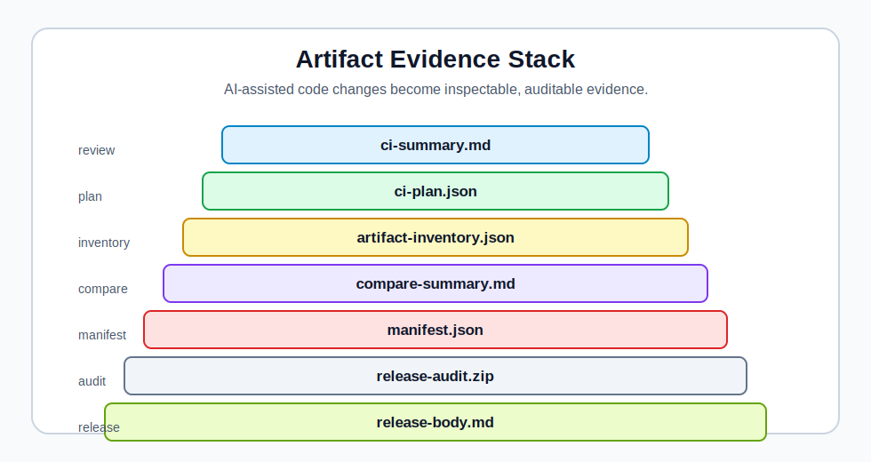

# VibeBench Architecture

VibeBench Arena is a local-first quality console for Codex-first / vibe-coding work. It turns AI-assisted code changes into inspectable artifacts, GitHub review evidence, and release audit records.

## What Enters The System

VibeBench starts from a normal repository checkout:

- an AI coding change or human-authored patch
- project configuration in `.vibebench/config.yaml`
- configured test and lint commands
- Git diff state, changed files, and patch size
- release notes and package metadata when release readiness is checked

## What VibeBench Checks

VibeBench focuses on review evidence rather than replacing the coding agent:

- configured local checks and CI-style dry-run planning
- score, status, and risk level
- diff size, changed files, and risk findings
- suspicious paths, deleted tests, lockfile movement, and broad patches
- artifact availability and manifest consistency
- release and publish readiness using local-only checks

## What Artifacts It Produces

VibeBench writes Markdown, JSON, HTML, and bundle outputs that can be inspected locally or attached to CI runs.

Representative artifacts include:

- `ci-summary.md`
- `ci-plan.json`
- `artifact-inventory.json`
- `compare-summary.md`
- `manifest.json`
- `release-audit.zip`
- `release-body.md`

See the [artifact gallery](artifact-gallery.md) for a broader tour.

## How GitHub Users Inspect The Result

GitHub users can review VibeBench output through:

- the README landing diagrams
- GitHub Actions summaries and annotations
- PR-ready Markdown summaries
- downloadable run artifacts from CI
- checked-in sample artifacts for the public demo
- local release audit records before release work

The goal is to make AI-assisted changes easier to review without asking maintainers to trust a chat transcript.

## What Is Intentionally Local-First

The core workflow runs from the checkout. VibeBench does not require a hosted account for local checks, artifact generation, release readiness, or the one-command demo.

Local-first design matters because AI coding work often touches private source code, unreleased product ideas, and release decisions. The default path is inspect, verify, and decide locally.

## What The Project Does Not Do

VibeBench does not:

- replace human review
- act as a chatbot or coding agent
- serve as a hosted benchmark leaderboard
- automatically publish packages
- create tags or GitHub Releases during local checks
- call the GitHub API for the local demo
- claim adoption, revenue, customers, or investment outcomes

## Related Docs

- [Demo guide](demo.md)
- [Artifact gallery](artifact-gallery.md)
- [Product strategy](product-strategy.md)
- [Commercial potential](commercial-potential.md)
- [Public roadmap](roadmap-public.md)
