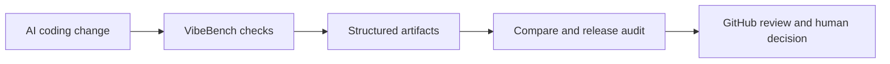

# VibeBench Artifact Gallery

VibeBench is a Codex-first / vibe-coding quality console. Its artifacts turn AI-assisted code changes into inspectable evidence: checks, reports, comparisons, artifact inventories, release readiness, release audit bundles, and GitHub-friendly summaries.

## Why Artifacts Matter

Vibe coding is fast, but review still needs evidence. A single `passed` or `failed` result is not enough when humans need to understand what changed, what ran, what can be reproduced, and what is safe to release.

VibeBench artifacts make AI-assisted changes reviewable by leaving local, CI-readable records that can be inspected before commit, in GitHub Actions, during release preparation, or after a run is archived.

They are the proof layer behind the broader [project positioning](positioning.md), [product strategy](product-strategy.md), [public roadmap](roadmap-public.md), and [commercial potential](commercial-potential.md): VibeBench makes AI-assisted coding reviewable, auditable, and reproducible.

Want the quickest preview? Run the one-command demo with `python3 -m vibebench demo`, copy the pack with `python3 -m vibebench demo --copy-to /tmp/vibebench-demo`, or browse the checked-in [sample artifacts](../examples/showcase-artifacts/sample/README.md) before running the full quality console locally. This artifact gallery is the fastest way to evaluate the local-first evidence trail from GitHub.

For a visual version of this evidence model, see the [artifact evidence stack](assets/artifact-evidence-stack.svg) and the [architecture](architecture.md) doc.

## Artifact Tour

| Artifact / output | What it proves | Command | Safe/local-only | Usual location |
| --- | --- | --- | --- | --- |
| CI plan / CI result | Shows the configured quality pipeline and records the run outcome. | `python3 -m vibebench ci --dry-run --json` or `python3 -m vibebench ci` | Local by default; no publish or release action. | `.vibebench/runs/<timestamp>/` |
| Artifacts inventory | Lists which run outputs exist and where to find them. | `python3 -m vibebench artifacts --json` | Read-only local inspection. | stdout; run artifacts under `.vibebench/runs/<timestamp>/` |
| Compare report | Explains movement between the latest run and a previous run. | `python3 -m vibebench compare --json` | Read-only unless writing normal local compare artifacts. | `.vibebench/runs/<timestamp>/compare.json` and `compare.md` |
| Package-check output | Captures local package/install readiness evidence. | `python3 -m vibebench package-check --json` | Local-only; does not upload packages. | stdout or `package-check.json` / `package-check.md` when requested |
| Publish-check output | Dry-runs publish readiness without publishing. | `python3 -m vibebench publish-check --json` | Local-only; no package publish/upload. | stdout or `publish-check.json` / `publish-check.md` when requested |
| Release-checklist output | Records pre/post-release checklist status for a target version. | `python3 -m vibebench release-checklist --json` | Read-only; no tag, release, upload, publish, or version bump. | stdout or `release-checklist.json` / `release-checklist.md` when requested |
| Release-audit bundle | Collects package, publish, checklist, release-body, audit summary, manifest, and optional zip records. | `python3 -m vibebench release-audit --zip --output-dir /tmp/vibebench-release-audit-demo` | Local-only; no tag, GitHub Release, API call, publish/upload, or version bump. | Selected output directory, commonly under `/tmp` or `.vibebench/release-audits/` |
| Release body export | Produces a copy/paste GitHub Release body from release notes. | `python3 -m vibebench release-body --version v0.3.0 --output /tmp/vibebench-release-body-demo.md` | Local-only; does not create a GitHub Release. | Requested Markdown path |

## How To Use This Gallery

Start with the [demo guide](demo.md) if you want to run the project. Use the [showcase artifact example](../examples/showcase-artifacts/README.md) if you want a copy-paste command tour. The important idea is simple: VibeBench does not ask reviewers to trust an AI coding session blindly; it leaves evidence that can be checked, compared, audited, reproduced, and discussed.
